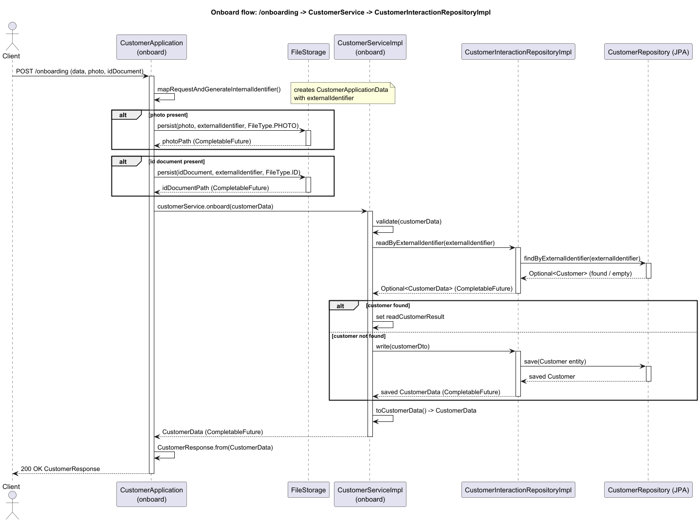

# Customer Onboarding API

## Design




## How to run

1. build the project using maven:
   ```bash
   mvn clean install
   ```
   
2. run the spring boot application:
   ```bash
   mvn spring-boot:run
   ```

3. call the api using one of the methods below.

#### Swagger UI

http://localhost:8083/swagger-ui.html


#### Using Postman

- import the provided Postman collection file 
  [Customer Onboarding API.postman_collection.json](./collection/CustomerOnboarding.postman_collection.json)
  into your Postman application.

#### docker

Not necessary for this project.

But if you want to run the application in a docker container.
- download docker
- run docker
- build image for your required database
- run the container with the spring application and assign the database 
  conatinaer volume to the application container
- adjust the application.properties file to point to the database container


4. to check out the data in the database, you can use the H2 console:

#### H2Database
For simplicity, this project uses an in-memory H2 database to store customer data.
However, by changing the settings in the application.properties file, you can easily switch
to another database like MySQL or PostgreSQL.

note: to see the h2 database console while running the API application,
go to http://localhost:8083/h2-console

 - JDBC URL: jdbc:h2:mem:onboarding
 - username sa
 - password: (leave blank)


## Use of AI and AutoComplete

this project used gpt to help with:

- autocompletion of lines (mostly comments, javadocs, attribute names, and 
  strings)
- attribute generation for classed (dto, entity, getters/setters)
- setting up application properties
- generation of this very readme file
- creation of file storage (methods that have been created by AI has javadoc 
  that mentions it was created by AI)
- Generation of swagger yaml file

** Basically all labour non-technical work has been done by AI. **


## What this API lacks

- removing the photo from the file storage when the customer is not created 
   due to technical errors.
- integration test for when the customer already exists. (not needed for demo )
   purposes)


